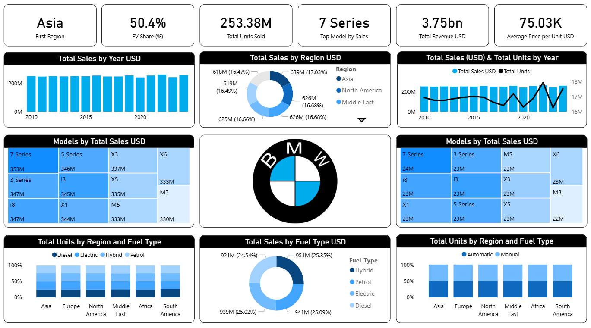

# 🚗 BMW Sales Performance Dashboard

This Power BI dashboard provides a **comprehensive analysis of BMW’s global sales performance (2010–2024)**.  
It highlights **revenue trends, regional performance, model-wise insights, and fuel-type distribution**, enabling a clear understanding of BMW’s business evolution and electric vehicle (EV) adoption rate.

---

## 📸 Dashboard Preview

---

## 📊 Key Insights & Business Findings

### 🌍 Regional Performance
- **Asia** leads as the top-performing region with **over 17% of total global sales**, followed closely by **North America** and the **Middle East**.
- Consistent contribution from all six global regions indicates **a well-diversified market presence**.

### 🚘 Model-wise Insights
- **7 Series** dominates sales, generating **the highest total revenue (≈353M USD)**, reflecting the strength of BMW’s luxury sedan line.  
- Other strong performers include **5 Series**, **3 Series**, and the **i3 electric model**, showing BMW’s success in both **premium** and **eco-friendly** vehicle segments.

### ⚙️ Fuel Type Analysis
- **Hybrid** vehicles contributed **25.35%** of total sales, slightly surpassing **Petrol** and **Electric** categories — demonstrating a **balanced transition toward sustainable mobility**.  
- **Diesel** models remain relevant but are gradually declining in favor of **Electric and Hybrid** vehicles.

### 📈 Yearly Trends
- Sales have grown steadily over the years, with notable spikes around **2021–2022**, aligning with **BMW’s global push for EV expansion**.  
- Despite economic fluctuations, BMW maintained a consistent sales volume and **positive year-over-year growth**.

### ⚡ EV Adoption
- EV share has reached **50.4%**, marking a **major milestone** in BMW’s electrification strategy and aligning with the company’s sustainability goals.

### 💹 Revenue and Units
- **Total Revenue:** 3.75 **billion USD**  
- **Total Units Sold:** 253.38 **million units**  
- **Average Price per Unit:** 75.03 **K USD**

---

## 🧩 Dashboard Features

- Interactive filters for **Region**, **Model Type**, and **Fuel Type**
- Dynamic KPIs and **year-over-year growth visuals**
- DAX-based metrics for **total sales, revenue, and EV share**
- Clean, professional visual design emphasizing clarity and insight

---

## ⚙️ Tools & Technologies Used

| Tool | Purpose |
|------|----------|
| **Power BI Desktop** | Dashboard creation, DAX modeling, and visualization |
| **Excel / CSV Dataset** | Data source (BMW Worldwide Sales 2010–2024) |
| **Power Query** | Data cleaning and transformation |
| **DAX (Data Analysis Expressions)** | Calculated columns and performance KPIs |

---

## 🧠 Business Value

This dashboard serves as a **strategic decision-support tool** that helps BMW:
- Identify **top-performing models and markets**
- Track the **progress of EV adoption**
- Compare **fuel-type performance** across regions
- Understand **customer preferences** and align future strategies

---

## 🚀 How to View the Dashboard

1. Download the `BMW-Sales.pbix` file from this folder.  
2. Open it in **Microsoft Power BI Desktop**.  
3. Explore visuals interactively — hover, filter, and drill through.

---

## 🧠 Future Enhancements

- Add **predictive analytics** to forecast sales and EV adoption trends  
- Integrate **customer satisfaction and market sentiment data**  
- Deploy the dashboard using **Power BI Service for public view**

---

## 👨‍💻 About the Creator

**K.S. Shankar**  
📍 Coimbatore Institute of Engineering and Technology  
💼 Aspiring **Data Analyst | Python Developer | Prompt Engineer**  
🌐 [LinkedIn](https://www.linkedin.com/in/) | [GitHub](https://github.com/)  

> _“Every number tells a story — this dashboard reveals BMW’s journey toward innovation, performance, and sustainability.”_
